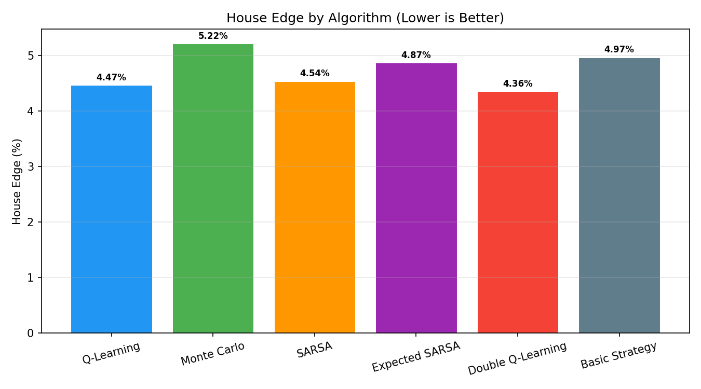

# Blackjack RL

## Train a model and compare whether you are better than an AI who have played thousands or millions of games

## Motivation
I created this project as someone who is really interested in reinforcement learning and is trying to learn different concepts and algorithms.

What I learnt:
- How different RL models converge to a solution
- Types of RL models and their characteristics
- Working with different epsilon values

## Installation

### Prerequisites
- Python 3.10+
- Node.js 18+

```bash
cd blackjackRL
pip install -r backend/requirements.txt
```

```bash
cd blackjackRL/frontend
npm install
```

### Running
# from the blackjackRL/ root
```bash
uvicorn backend.main:app --reload --port 8000
```
# from the blackjackRL/frontend/ directory
```bash
npm run dev
```
After both the frontend and backend server is started, open http://localhost:5173 in your browser.


## Features
1. Play simplified blackjack!
- Blackjack is a betting card game. To win as a player, you either: 1. have a total value of cards larger than the dealer's 2. The dealer busted (the dealer's sum of cards are above 21)
- Out of the 52 cards, the cards' values are based on their numerical value, or 10 for JQK. For Ace, it can either be interpreted as 1 or 11.
- In this simplified blackjack game, we will not have mechanisms like splitting (this gives the house a greater edge, I will talk about it later). We will only be able to hit (ask for additional card) or stand (to stay and let the dealer start his turn)

Flow:
- The player has the sum of cards held. The player can request additional cards (hit) until they decide to stop (stand) or exceed 21 (bust, immediate loss).
- After the player stands, the dealer reveals their facedown card, and draws cards until their sum is 17 or greater. If the dealer goes bust, the player wins.
- If neither the player nor the dealer busts, the outcome (win, lose, draw) is decided by whose sum is closer to 21.

2. Train your own Reinforcement learning model!
- You will be able to access a training dashboard with different hyperparameters that you can tune.
- Below are the supported learning algorithms:
- SARSA, Expected SARSA, Monte Carlo Policy, Q learning, Double Q learning

3. Play with an AI model!
- You will be able to play alongside your own trained model. Feeling lucky and confident? See if you are better than the AI who played millions of games!

## Statistics

All results from training at **1,000,000 episodes**, evaluated over **100,000 greedy games**.

| Algorithm | Win Rate | Loss Rate | Draw Rate | Avg Reward | House Edge |
|---|---|---|---|---|---|
| Q-Learning | 43.25% | 47.72% | 9.03% | -0.0447 | 4.47% |
| Monte Carlo | 43.46% | 48.68% | 7.86% | -0.0522 | 5.22% |
| SARSA | 43.09% | 47.63% | 9.28% | -0.0454 | 4.54% |
| Expected SARSA | 43.09% | 47.96% | 8.95% | -0.0486 | 4.87% |
| **Double Q-Learning** | **43.37%** | **47.73%** | **8.90%** | **-0.0436** | **4.36%** |
| Basic Strategy (baseline) | 43.11% | 48.08% | 8.82% | -0.0497 | 4.97% |



- **Best performer:** Double Q-Learning at 4.36% house edge
- **3 of 5 RL agents beat standard basic strategy** (4.97%) — because basic strategy is designed for full blackjack with splitting/doubling, which this environment does not support. 
- The theoretical optimal house edge with perfect strategy (~0.5%) requires split/double/surrender actions not available here
- See [`report/report.md`](report/report.md) for full learning curves and benchmark figures


## Tech Stack
Backend:  Python · FastAPI · Gymnasium (Blackjack-v1) · NumPy
Frontend: React · Vite · Recharts
