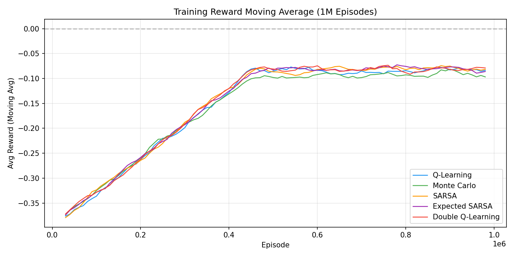
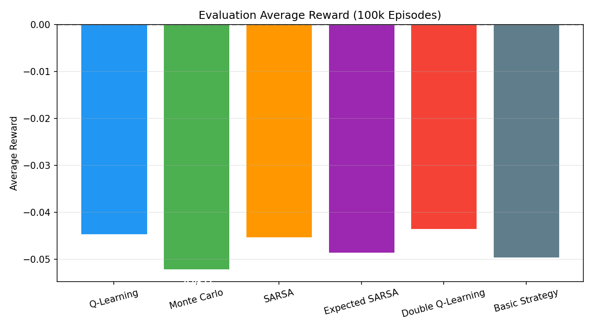
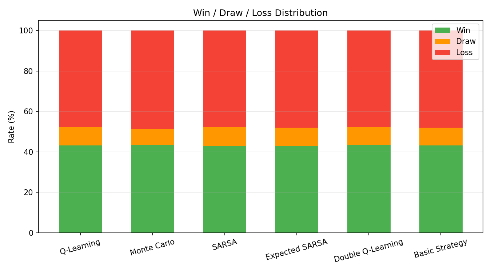
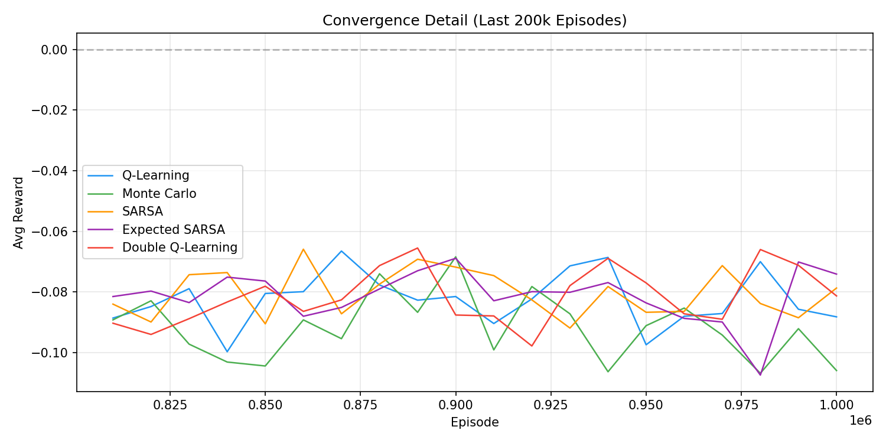
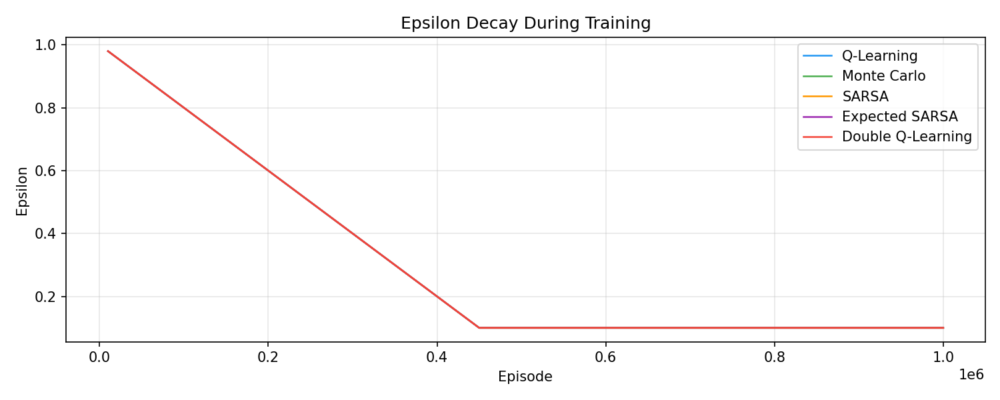

# Blackjack RL — Algorithm Benchmark Report

**Training:** 1,000,000 episodes per algorithm | **Evaluation:** 100,000 episodes (greedy policy)
**Environment:** Gymnasium `Blackjack-v1` (stick-after-bust = True)

---

## Algorithms

| Algorithm | Type | Key Idea |
|---|---|---|
| **Q-Learning** | Off-policy TD | Updates with max Q(s', a') — always assumes optimal future |
| **Monte Carlo** | On-policy MC | Updates after full episode using actual returns |
| **SARSA** | On-policy TD | Updates with actual next action a' (follows the policy) |
| **Expected SARSA** | Off-policy TD | Updates with expected Q over the policy distribution |
| **Double Q-Learning** | Off-policy TD | Two Q-tables — one selects, other evaluates — reduces overestimation |
| **Basic Strategy** | Lookup table | Hand-coded optimal hit/stand rules from probability theory |

---

## Final Benchmark Table

| Algorithm | Win Rate | Loss Rate | Draw Rate | Avg Reward | House Edge | Train Time |
|---|---|---|---|---|---|---|
| Q-Learning | 43.25% | 47.72% | 9.03% | -0.0447 | 4.47% | 30.4s |
| Monte Carlo | 43.46% | 48.68% | 7.86% | -0.0522 | 5.22% | 27.7s |
| SARSA | 43.09% | 47.63% | 9.28% | -0.0454 | 4.54% | 29.1s |
| Expected SARSA | 43.09% | 47.96% | 8.95% | -0.0486 | 4.87% | 32.4s |
| **Double Q-Learning** | **43.37%** | **47.73%** | **8.90%** | **-0.0436** | **4.36%** | 29.6s |
| Basic Strategy | 43.11% | 48.08% | 8.82% | -0.0497 | 4.97% | N/A |

- **Best RL agent:** Double Q-Learning (4.36% house edge) — **beats basic strategy by 0.61%**
- **Basic strategy underperforms** because standard charts are designed for full blackjack (splitting, doubling down, surrender) — in a hit/stand-only environment, RL agents can find a better policy
- **3 of 5 RL agents beat basic strategy** (Q-Learning, SARSA, Double Q-Learning)
- The theoretical ~0.5% house edge requires split/double/surrender actions not available in this environment

---

## Training Reward Moving Average



- All algorithms converge within the first ~500k episodes
- Initial exploration phase (high epsilon) shows negative rewards across the board
- After epsilon decays, rewards stabilize around -0.04 to -0.05

---

## Evaluation Average Reward



- All algorithms cluster tightly between -0.044 and -0.052
- Double Q-Learning edges out slightly with -0.0436
- Basic strategy sits at -0.0497 — beaten by 3 of 5 RL agents
- Monte Carlo trails at -0.0522 — likely needs more episodes to fully converge

---

## House Edge Comparison


- Lower is better — represents how much the house wins per unit bet
- Double Q-Learning: **4.36%** (best)
- Basic Strategy: **4.97%** — RL agents can outperform hand-coded rules in this simplified game
- Monte Carlo: **5.22%** (worst)
- The TD methods (Q-Learning, SARSA, Expected SARSA) cluster around 4.5-4.9%

---

## Win / Draw / Loss Distribution



- Win rates are remarkably similar (~43%) across all methods
- Main differentiator is draw rate vs. loss rate
- SARSA achieves the highest draw rate (9.28%) — more conservative play

---

## Convergence Detail (Last 200k Episodes)



- All algorithms have converged — fluctuations are due to stochastic environment
- No algorithm shows signs of divergence or instability
- Variance is roughly equal across methods

---

## Epsilon Decay



- Linear decay from 1.0 to 0.1 over first 500k episodes
- All algorithms use identical decay schedule for fair comparison
- Exploration ends at episode 500k; remaining 500k episodes are near-greedy

---

## Key Takeaways

- **RL agents can beat basic strategy** — 3 of 5 agents outperform the hand-coded lookup table in this hit/stand-only environment
- **Double Q-Learning wins** — overestimation correction helps in Blackjack's stochastic environment (4.36% vs 4.97% basic strategy)
- **Basic strategy is not optimal here** — it's designed for full blackjack with split/double/surrender; RL agents optimize specifically for the available actions
- **Monte Carlo is simplest but slowest to converge** — episode-level updates mean slower credit assignment
- **SARSA is the most conservative** — on-policy learning leads to higher draw rates (avoids risky hits)
- **State space is small** (704 states) — tabular methods converge easily; differences between algorithms are subtle
- **Gap to theoretical perfect play is structural** (~4.4% vs ~0.5%) — closing it requires split/double/surrender actions not available in Gymnasium Blackjack-v1

---

## Reproduction

```bash
# Backend
cd blackjackRL
uvicorn backend.main:app --reload --port 8000

# Frontend
cd frontend && npm run dev
```

Train any algorithm from the Dashboard, then play against it in Play Mode.
